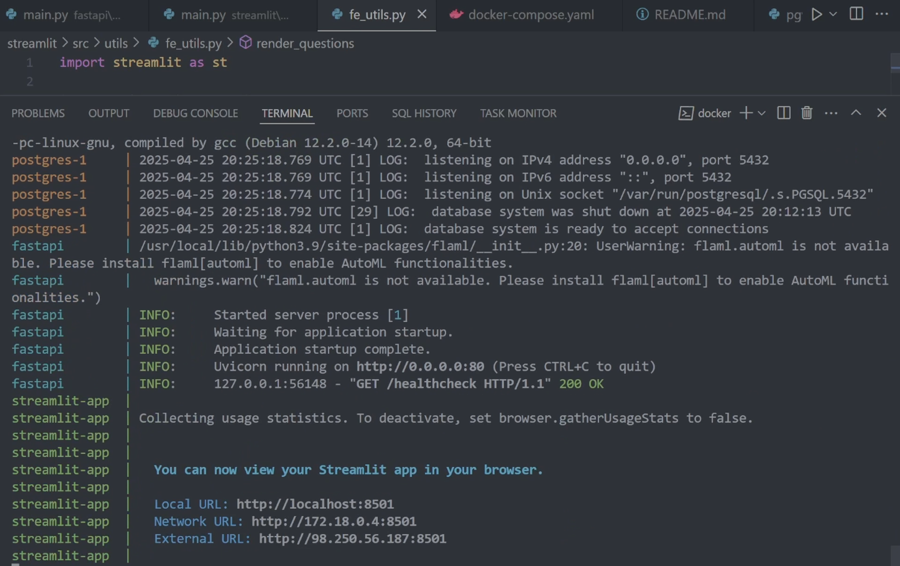
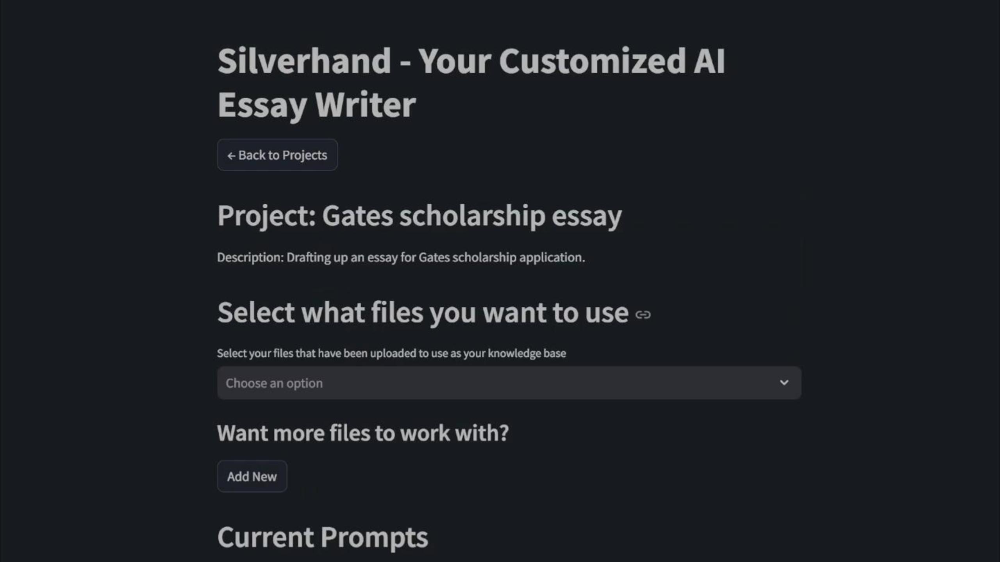
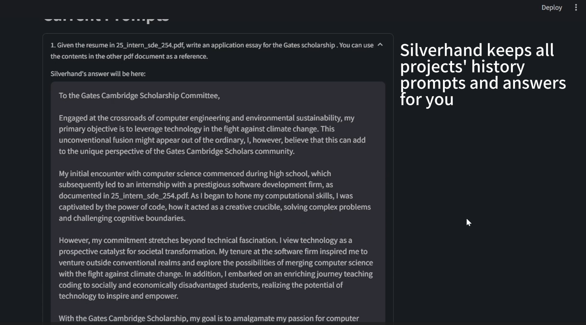
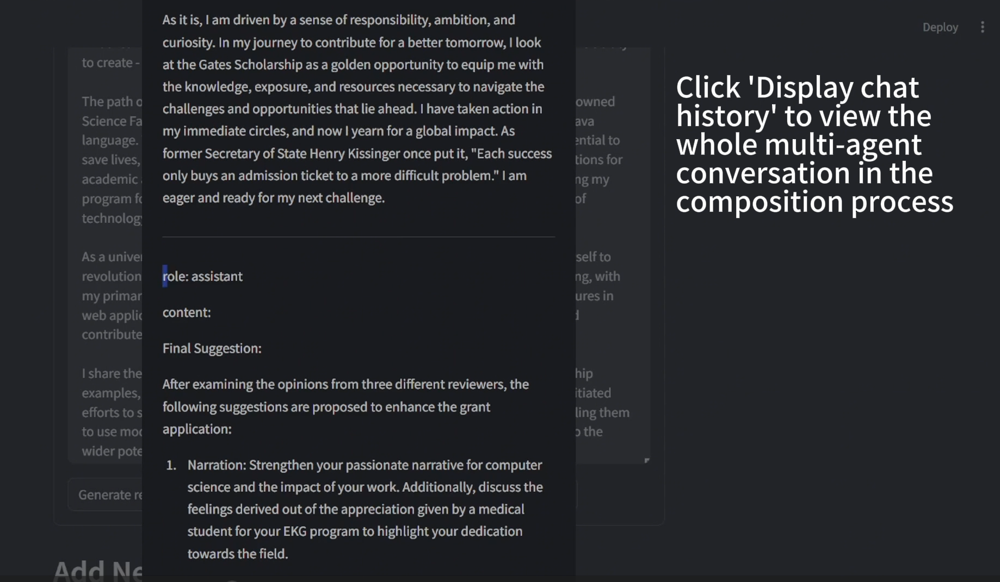
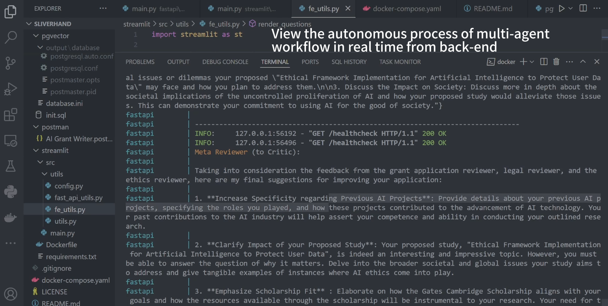

This repository provides the **Silverhand**, an end-to-end solution leveraging state-of-the-art AI frameworks to automate and refine application writing. It orchestrates specialized legal, ethical, and essay-review agents using Microsoft’s AutoGen multi-agent framework, combines a Retrieval-Augmented Generation (RAG) pipeline with PostgreSQL/pgvector for contextual document retrieval, and exposes a robust REST API with FastAPI and Pydantic models. A Streamlit front-end offers a user-friendly interface, and the entire stack is containerized via Docker for seamless deployment.  
## Demo 







A demo video of this [application](https://youtu.be/s3rSBpWhd1o).

## Features

- **Multi-Agent Orchestration**  
  Utilizes Microsoft AutoGen to define and coordinate multiple AI agents (e.g., legal, ethical, essay-review agents) in a conversation framework for iterative content refinement citeturn0search0turn0search2.

- **Retrieval-Augmented Generation (RAG) Pipeline**  
  Implements a RAG workflow to ingest, split, embed, and retrieve document chunks, ensuring responses are grounded in relevant source material citeturn1search1turn1search2.

- **Vector Embeddings with pgvector**  
  Stores and queries high-dimensional embeddings in PostgreSQL via the pgvector extension, interfaced through LangChain’s vectorstore abstraction for efficient similarity search citeturn1search0.

- **FastAPI-Powered REST API**  
  Exposes endpoints for document upload, agent orchestration, and retrieval operations using FastAPI’s OpenAPI-based auto-documentation (Swagger UI) and Pydantic data validation citeturn3search0.

- **Streamlit Front-End**  
  Provides an interactive web application built with Streamlit for users to submit requests, view agent dialogues, and download refined application drafts citeturn4search0.

- **Semantic Text Splitting**  
  Includes a `SemanticChunker` that adaptively segments large documents based on embedding similarity, maximizing retrieval precision and contextual coherence citeturn6search0.

- **Containerized Deployment**  
  Encapsulates the entire toolchain within Docker containers for consistent development, testing, and production environments citeturn5search0.

- **OpenAI API Integration**  
  Leverages the OpenAI Embeddings and Chat Completion APIs to generate and refine text with context-aware LLM calls citeturn7search0.

## Architecture

1. **Agent Layer**  
   - **AutoGen Agents**: Define roles (e.g., “EssayReviewerAgent”, “EthicsAgent”) to iteratively critique and refine draft sections.  
   - **Conversation Orchestration**: Automate message flow among agents to converge on high-quality content.

2. **RAG Pipeline**  
   - **Ingestion & Chunking**: Documents are split using `SemanticChunker`, producing semantically cohesive chunks.  
   - **Embedding & Storage**: Each chunk is embedded via OpenAI API and stored in PostgreSQL/pgvector.  
   - **Retrieval**: On query, top-k relevant chunks are fetched and provided as context to the LLM.

3. **API Layer**  
   - **FastAPI Endpoints**: Include `/upload`, `/generate`, and `/retrieve` routes, documented via Swagger UI for ease of integration.  
   - **Data Models**: Enforced with Pydantic for robust request/response schemas.

4. **Front-End**  
   - **Streamlit App**: Offers file upload widgets, real-time progress logs, and download links for final essay drafts.

5. **Deployment**  
   - **Docker Compose**: Defines services for the API, database, and front-end.  
   - **Scaling**: Easily extendable for distributed agent execution and database replication.

## Installation

1. **Prerequisites**   
   - OpenAI API key;
   - At least 25 GB available local disk storage for docker images;
   - At least 24 GB available RAM;

2. **Clone & Configure**  
   ```bash
   git clone https://github.com/samplecatalina/silverhand.git
   cd silverhand
   # Set OPENAI_API_KEY and database credentials in ./config/.env
   ```

3. **Build & Run**  
   Run the following from the root directory.  
    ```bash
    docker compose up --build 
    ```

    Once the application has started up, navigate to: 
    ```bash
    http://localhost:8501/
    ```
    
    If you want to completely clean up your application stack and start fresh after you finished using the application, run the following:
    ```
    docker compose down
    ```

4. **Access**  
   - API docs: http://localhost:8000/docs  
   - Streamlit UI: http://localhost:8501  

## Usage

- **Upload Documents**: Use the `/upload` endpoint or the Streamlit interface to add your essay background materials.  
- **Generate Draft**: Call `/generate` with parameters (e.g., target funder, organization details) to initiate the multi-agent workflow.  
- **Retrieve Context**: Use `/retrieve` to fetch specific sections or agent critiques.  
- **Download Output**: The Streamlit app provides links to download the final, polished essay application.


## License

This project is licensed under the MIT License.


## References 
* https://arxiv.org/pdf/2308.08155
* https://arxiv.org/pdf/2403.10131

